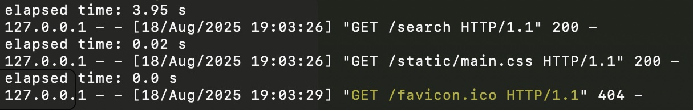
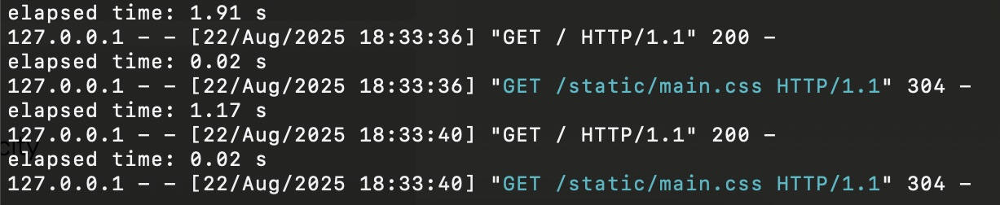
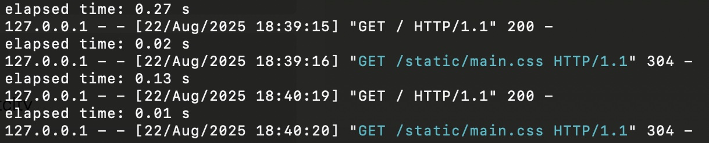

# 🔄 PlantSwap 🪴

PlantSwap on sovellus, jossa käyttäjät voivat lisätä ilmoituksia huonekasveista, jotka haluaisivat antaa vaihtoon. Sovelluksen tarkoitus on, että sen avulla voi vaihtaa kasveja tai pistokkaita muiden käyttäjien kanssa tai esimerkiksi löytää uuden kodin kasville, jota ei voi/halua pitää, ja saada vaihdossa toisen toivomansa kasvin. Haluamansa kasvin löydettyään käyttäjä voi ottaa yhteyttä ilmoituksen tekijään kommentilla.

1. [Asennus (Linux/MacOS)](#asennusohjeet) <br/>
2. [Sovelluksen tila](#tila) <br/>
3. [Sovelluksen testaus](#testaus) <br/>
3.1. [Ohjeet testaukseen](#testausohjeet) <br/>
3.2. [Testauksen tulokset](#testaustulokset) <br/>

## <a name="asennusohjeet"></a> Asennus (Linux/MacOS)

Seuraavat ohjeet on tarkoitettu sovelluksen asennukseen Linux- ja MacOS-käyttöjärjestelmillä. Muilla käyttöjärjestelmillä komennot ja sivuston osoite saattavat poiketa.

Suorita seuraavat komennot projektikansiossa.

Alusta tietokanta:

```
$ sqlite3 database.db < schema.sql
$ sqlite3 database.db < init.sql
```

Asenna Pythonin virtuaaliympäristö ja Flask:

```
$ python3 -m venv venv
$ source venv/bin/activate
$ pip install flask
```

Käynnistä sovellus komennolla

```
$ flask run
```

Sovellus käynnistyy oletusarvoisesti osoitteeseen http://127.0.0.1:5000

## <a name="tila"></a> Sovelluksen tila

### Kirjautuminen ja profiili

- Käyttäjä voi luoda tunnuksen ja kirjautua sisään.
- Käyttäjä voi vaihtaa ja poistaa profiilikuvansa.
- Käyttäjä näkee muiden käyttäjien profiilit.
- Profiilissa näkyy lista käyttäjän luomista ilmoituksista.
- Käyttäjä voi poistaa tilinsä. Tili ei katoa tietokannasta, vaan sen status muuttuu. Kun tili poistetaan, kaikki käyttäjän lisäämät ilmoitukset ja niiden kommentit, luokat ja kuva poistetaan samalla tietokannasta, koska sovelluksen käyttötarkoituksen vuoksi niiden säilyttäminen ei ole hyödyllistä.

### Ilmoitukset (pääasiallinen tietokohde)

- Käyttäjä voi lisätä, muokata ja poistaa ilmoituksia. Ilmoitus poistuu tietokannasta pysyvästi.
- Käyttäjä voi vaihtaa ja poistaa ilmoituksen kuvan.
- Kasville voi lisätä luokitteluja: tyyppi (pistokas/kokonainen kasvi) ja valon tarve (vähäinen/keskitaso/runsas). Luokkia voi päivittää jälkeenpäin.
- Jokainen ilmoitus avautuu omalle sivulleen, jossa näkyy siihen liittyvät tiedot: lisäyspäivä, luokat, sijainti, katselukerrat, kommentit ja ilmoituksen tehneen käyttäjän sijainti.

### Kommentit (toissijainen tietokohde)

- Käyttäjä voi lisätä kommentin ilmoitukseen.
- Käyttäjä voi muokata ja poistaa omia kommenttejaan. Kommentti poistuu tietokannasta pysyvästi.

### Haku

- Käyttäjä voi hakea ilmoituksia kasvin nimen ja/tai sijainnin perusteella.

### Tietoturva

- Kaikkien tietokohteiden luontiin, muokkaukseen ja poistamiseen liittyvät toiminnot vaativat sisäänkirjautumisen. Käyttäjältä on estetty muiden kuin hänen omien tietokohteidensa muokkaus ja poisto.
- csrf on käytössä kaikissa lomakkeissa, jotka vaativat sisäänkirjautumisen.

## <a name="testaus"></a> Sovelluksen testaus

### <a name="testausohjeet"></a> Ohjeet testaukseen

Sovelluksen tehokkuutta voi halutessaan testata ajamalla projektikansiossa komennon

```
$ python3 seed.py
```

Sovelluksen voi sen jälkeen käynnistää normaalisti komennolla 

```
$ flask run
```

seed.py-tiedosto sisältää skriptin, joka lisää tietokantaan 1000 käyttäjää, 100 000 listausta ja miljoona kommenttia. Aina kun sivu ladataan sovelluksen ollessa käynnissä, komentotulkkiin tulostuu lataukseen kulunut aika.

### <a name="testaustulokset"></a> Testauksen tulokset

Sovelluksen toiminnan nopeuttamiseksi etusivulla on käytössä sivutus. Tietokantaan on myös lisätty kaksi indeksiä nopeuttamaan hakuja. Seuraavissa kuvissa on nähtävissä etusivun latausnopeus ilman näitä ominaisuuksia sekä niiden kanssa. Ennen testausta tietokantaan on lisätty suuri määrä tietoa yllä kuvatun seed.py-tiedoston avulla.

#### Ei sivutusta, ei indeksiä



Ilman sivutusta tai indeksiä etusivun latausnopeus on melkein 4 sekuntia.

#### Sivutus ja yksi indeksi



Sivutuksen ja indeksin käyttöönoton (luokkatauluun) jälkeen latausaika lyheni 1-2 sekunnilla.

#### Sivutus ja kaksi indeksiä



Toisen indeksin lisäys (kommenttitauluun) lyhensi latausajan alle sekuntiin.